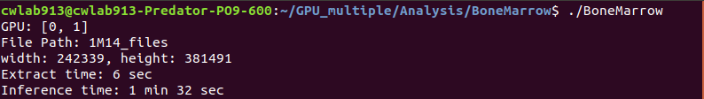

# BoneMarrow

## Associated paper
Wang C.*, Huang S., Lee Y., Shen Y., Meng S., Gaol J.(2022) Deep Learning for Bone Marrow Cell Detection and Classification on Whole-Slide Images, Medical Image Analysis, vol 75, 102270, 1-15 (SCI IF=13.828, 2/113 COMP. SCI., INTER. APP.). 
If you use any materials here, please cite our publication.  

## Cloud Demo
AI inference process and results are shown in the dmeo [video](https://drive.google.com/file/d/1BnJMrl5gJLrLxgFycA2eJXmcHHZ_dKyG/view?usp=sharing).

#### Device specifications
- **CPU:** Intel Xeon Gold 6148
- **RAM:** 512 GB
- **GPU:** NVIDIA TITAN RTX 24 GB * 4

#### Time consumption
- **Data extraction time:** 328 seconds
- **AI Inference time:** 336 seconds

In the cloud demo, the system gets a WSI file from the remote NAS, and hence the data extraction time takes more than the workstation demo.


## Workstation Demo
AI inference process and results as follows with demo data 1M14.mrxs.
##### 

#### Device specifications
- **CPU:** Intel Core i9-7900X
- **RAM:** 128 GB
- **GPU:** NVIDIA GeForce GTX 1080 Ti 11 GB * 2

#### Time consumption
- **Data extraction time:** 6 seconds
- **AI Inference time:** 94 seconds

In the workstation demo, the WSI file is stored locally, and hence the data extraction time takes less than the cloud demo.


## Setup

#### Requirerements
- ubuntu 18.04
- RAM >= 16 GB
- GPU Memory >= 6 GB
- GPU driver version >= 410.48
- CUDA version >= 10.0
- cuDNN version >= 7.4.2

#### Download
Execution file, configuration file, and models are download from the [zip](https://drive.google.com/file/d/1_2pU3tUDzkk_vraTsqM8aVfMjO0VjhJl/view?usp=sharing) file.  (For reviewers, please use the manuscript number M...........R1 as the password to decompress the file.)

#### File structure
```
BoneMarrow/
│
├── BoneMarrow - execution file
├── setting.json - configuration file
│
├── TestImgTemp/ - temp data extraction folder
|
├── Data/ - inference data location
│   ├── 1M05.mrxs
│   ├── 1M05/
│   │   ├── Index.dat
│   │   ├── Slidedat.ini
│   │   ├── Data0000.dat
│   │   ├── Data0001.dat
│   │   ├── Data0002.dat
│   │   ├── Data0003.dat
│   │   ├── Data0004.dat
│   │   │       ⋮
│   │   └── Data0030.dat
│   │
|   ├── 1M14.mrxs
|   └── 1M14/
│       ├── Index.dat
│       ├── Slidedat.ini
│       ├── Data0000.dat
│       ├── Data0001.dat
│       ├── Data0002.dat
│       ├── Data0003.dat
│       ├── Data0004.dat
│       │       ⋮
│       └── Data0035.dat
│
├── Model/ - contains detection models
|   ├── BMntu10mix_9_i90w
|   └── NTU_ROI_i10w
|
└── Result/ - inference result is saved here

```

#### Inference
Open the setting.json file to set up the input WSI filename and the GPUs to use.    
The file format is as follows:  
```
{
    "DATA": "1M14.mrxs",    //the input WSI filename.
    "GPU": [0, 1]           //the ID(s) of GPU(s) to use for testing.
}
```

Then in a terminal run:  
```
./BoneMarrow
```


## License
This extension to the Caffe library is released under a creative commons license, which allows for personal and research use only. For a commercial license please contact Prof Ching-Wei Wang. You can view a license summary here:  
http://creativecommons.org/licenses/by-nc/4.0/


## Contact
Prof. Ching-Wei Wang  
  
cweiwang@mail.ntust.edu.tw; cwwang1979@gmail.com  
  
National Taiwan University of Science and Technology
